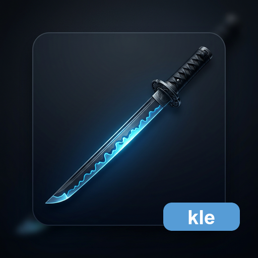

<p align="center">
  
</p>

<h1 align="center">katana-language-editor</h1>

<p align="center">
  Vendor-neutral language editor library for
  <a href="https://github.com/HiroyukiFuruno/KatanA">KatanA</a>.
</p>

<p align="center">
  <a href="LICENSE"></a>
  <a href="https://github.com/HiroyukiFuruno/katana-language-editor/actions/workflows/test-and-build.yml"></a>
  <a href="https://github.com/HiroyukiFuruno/katana-language-editor/releases/latest"></a>
  <a href="https://crates.io/crates/katana-language-editor"></a>
</p>

---

## Design

```
katana-language-editor        ← neutral trait + DTO (no egui, no framework)
katana-language-editor-egui   ← egui MVP implementation (TextEdit)
```

KatanA depends on both crates but calls only the neutral interface. When the
custom input surface replaces egui (`x-x-x-native-input-surface`), only the
`-egui` crate changes.

## Status

Scaffolding. Full implementation migrated from KatanA in the `v0.27.0` change
(`openspec/changes/v0-1-0-language-editor-extraction`).

## License

MIT
